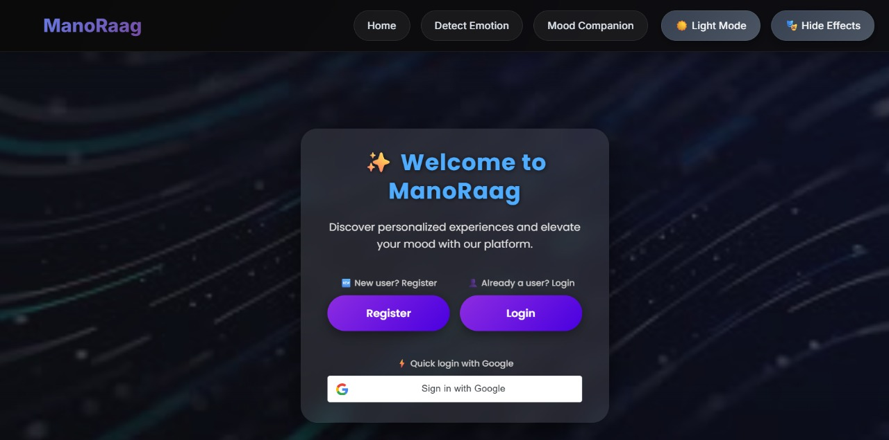
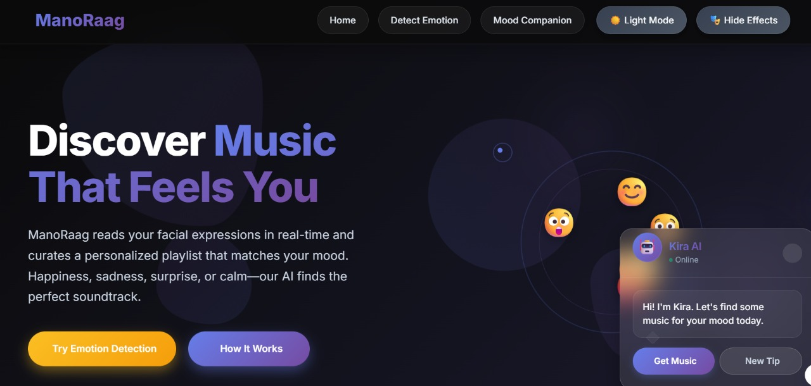
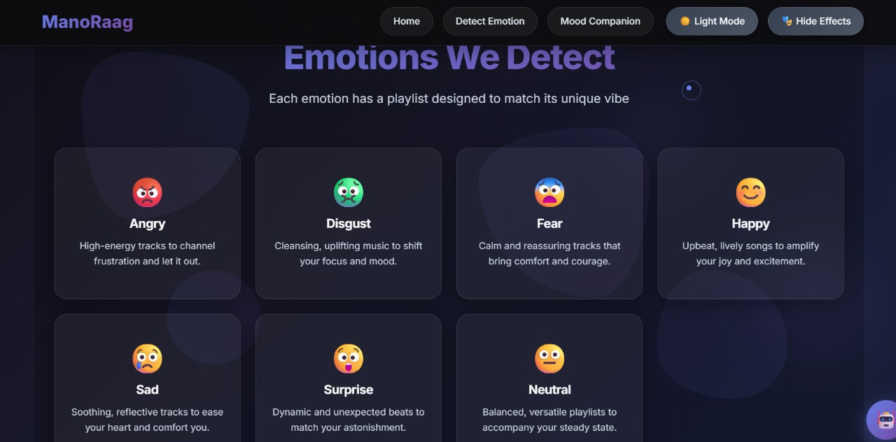
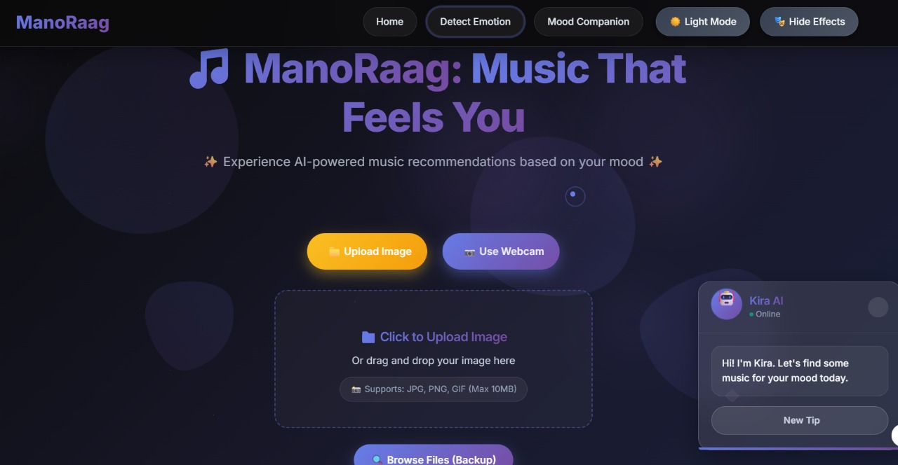
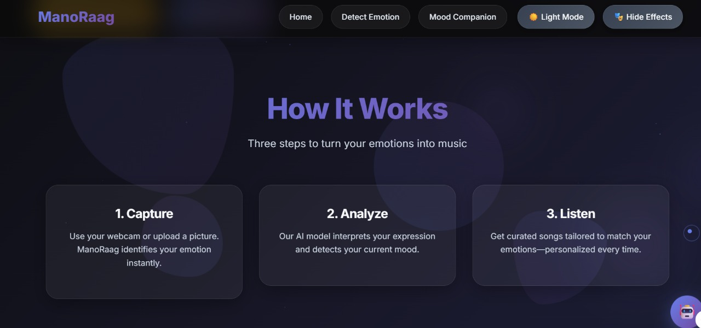
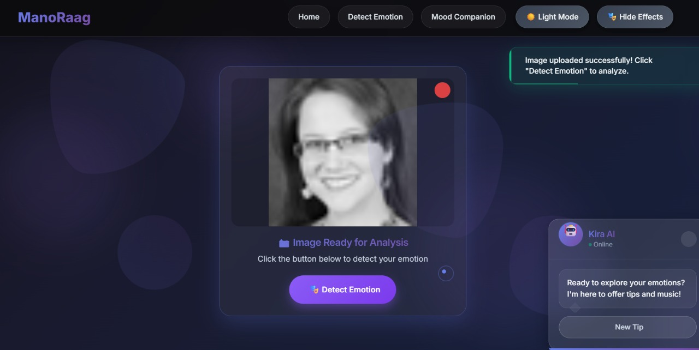
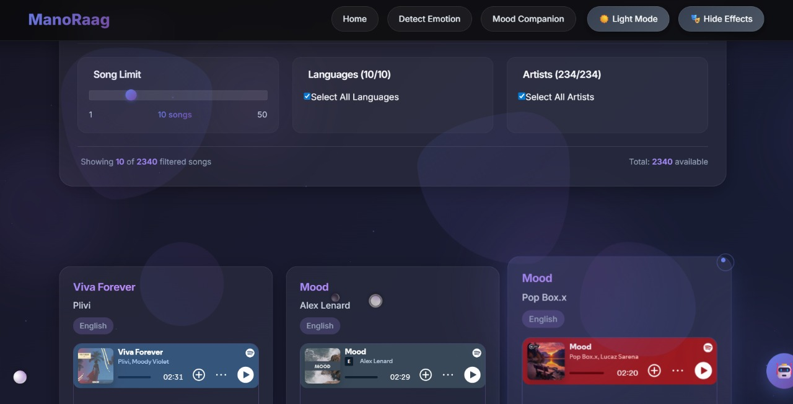
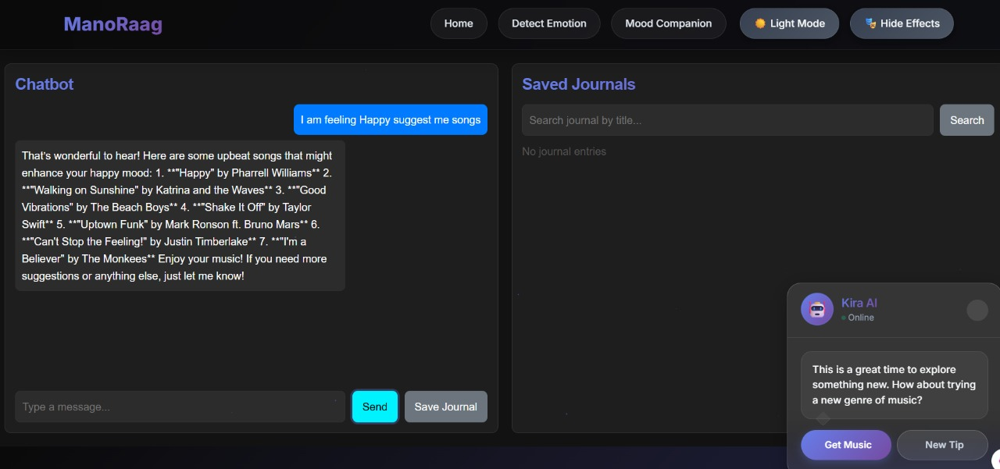

# 🎵 ManoRaag – AI-Based Emotion-Aware Music Recommender System

[](https://www.python.org/)
[](https://flask.palletsprojects.com/)
[](https://reactjs.org/)
[](https://mui.com/)
[](https://firebase.google.com/)
[](https://developer.spotify.com/)
[](LICENSE)

---

## 📑 Table of Contents
- [📌 Overview](#-overview)
- [🎯 Objectives](#-objectives)
- [⚡ Features](#-features)
- [⚙️ Tech Stack](#-tech-stack)
- [📂 Project Structure](#-project-structure)
- [🚀 Setup & Installation](#-setup--installation)
- [🛠️ Challenges & Solutions](#-challenges--solutions)
- [📚 Learnings](#-learnings)
- [📸 Screenshots](#-screenshots)
- [🎬 Demo GIF](#-demo-gif)
- [👨‍🏫 Mentors & Coordinator](#-mentors--coordinator)
- [🤝 Contributing](#-contributing)
- [🚀 Future Enhancements](#-future-enhancements)
- [📄 License](#-license)

---

## 📌 Overview

**ManoRaag** is an AI-based music recommender system that detects a user's emotional state through **facial expressions** in real-time and plays personalized music. 

It integrates **Machine Learning**, **React + Material-UI frontend**, **Flask backend**, **Firebase Authentication**, and **Spotify API** for a seamless emotionally adaptive experience.

---

## 🎯 Objectives

- Detect human emotions in real-time via webcam 
- Map emotions to relevant music genres 
- Fetch & play songs using Spotify API 
- Provide **secure login/signup** using Firebase Authentication 
- Deliver a scalable, user-friendly solution 

---

## ⚡ Features

| Feature | Status |
|---------|--------|
| Real-time emotion detection | ✅ |
| Emotion → Genre mapping | ✅ |
| Spotify API integration | ✅ |
| User login/signup (Firebase Auth) | ✅ |
| CRUD for user data | ✅ |
| Mobile responsive UI (Material-UI) | ✅ |
| Personalized playlists & history | 🚧 (future) |


## ⚙️ Tech Stack
1.Frontend: React + Material-UI

2.Backend: Flask

3.Machine Learning: Python, TensorFlow/Keras

4.Database: Firebase Authentication (user data)

5.APIs: Spotify API


```
📂 Project Structure
ManoRaag/ 
├── frontend/        # React + Material-UI frontend 
│   ├── src/
│   └── package.json
├── backend/         # Flask backend 
│   ├── app.py
│   └── requirements.txt
├── ml/              # ML models (.h5) and training scripts 
├── public/models/   # Pretrained face-api.js models 
├── .env             # Environment variables (API keys, etc.)
├── package.json     # For the entire project (optional)
├── README.md 
└── LICENSE 
 
```
## 🚀 Setup & Installation
Prerequisites
Node.js v16+

Python 3.8+

Git LFS installed (for large model files)

Spotify Developer API credentials

Firebase Project and API Key for authentication

Clone the Repository
```

git clone [https://github.com/Springboard-Internship-2025/ManoRaag.git](https://github.com/Springboard-Internship-2025/ManoRaag.git)
cd ManoRaag
```
1. Frontend Setup
Navigate to the frontend directory and install dependencies.
```

cd frontend
npm install
npm start

```
2. Backend Setup
Navigate to the backend directory, create a virtual environment, and install Python dependencies.
```

cd ../backend
pip install -r requirements.txt
python app.py

```
3. ML Models Setup (If retraining or re-exporting)
The primary models are pre-trained and included. Run this section only if you need to train the model from scratch or update the weights.
``
cd ../ml
python emotion_model.py
(Ensure all necessary environment variables, like API keys, are set in the .env file before running the application.)
```
## 🛠️ Challenges & Solutions
1.Large model files → Managed via Git LFS

2.Multiple branches → Coordinated via GitHub workflow

3.Node modules → .gitignore used to reduce repo size

4.Testing → Jest (frontend), PyTest (backend)

5.Hosting → IIS / Heroku deployment

## 📚 Learnings
1.Deep practical experience integrating a full MERN-like stack (React + Material-UI + Flask + ML).

2.Effective Git collaboration strategies for large development teams.

3.Implementing Firebase Authentication for secure and scalable user management.

4.Techniques for handling large datasets and managing binary files with Git LFS.

5.Applying SOLID principles and standard design patterns in a real-world project structure.

## 📸 Screenshots











## 🎬 Demo GIF


## 👨‍🏫 Mentor & Coordinator
Mentor: Revathi Venugari

Coordinator: Pradyumna V

## 🚀 Future Enhancements
1.Personalized Playlists & History: Implement database storage to track user history and generate more accurate, long-term personalized playlists.

2.Vocal/Speech Emotion Recognition: Integrate an audio-based ER system to supplement the facial detection for greater accuracy.

3.Emotion Intensity Mapping: Map subtle variations in emotion intensity to variations in music tempo and key.

4.Direct Spotify Playback Controls: Allow users to skip, pause, and like tracks directly within the ManoRaag UI.

📄 License
This project is licensed under the MIT License - see the LICENSE file for details.

